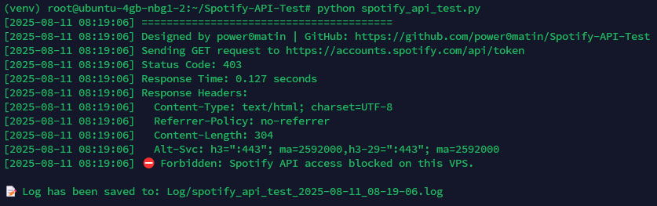

<h1 align="center">Spotify-API-Test 🚀</h1>

<p align="center">
  <a href="#">
        
  </a>
  <a href="#">
    
  </a>
  <a href="#">
  
  </a>
  <a href="#">
  
  </a>
</p>

## Overview 📝

A simple Python script to test Spotify API accessibility from your VPS or server.  
It performs a GET request to Spotify's OAuth token endpoint, logs the status, response time, and headers for debugging and connectivity verification.

This tool helps you verify if your VPS or hosting environment is able to access Spotify services without being blocked or rate-limited.




## Features ✨

- Tests connection to Spotify API token endpoint.
- Logs detailed response info including status code, headers, and response time.
- Saves logs with timestamp in a dedicated `Log/` directory.
- Easy to run with no dependencies other than `requests`.
- Useful for troubleshooting VPS access issues to Spotify.
- Designed and maintained by power0matin.

## Requirements 🛡️

- Python 3.7 or higher.
- `requests` library (`pip install requests`).

## Installation & Usage 📥

1. Clone the repository:

```bash
git clone https://github.com/power0matin/Spotify-API-Test.git
cd Spotify-API-Test
```

2. Install dependencies:

```bash
pip install requests
```

3. Run the test script:

```bash
python spotify_api_test.py
```

4. Check the console output and review the generated log file inside the `Log/` folder.

## Example Output 🖥️

```plaintext
[2025-08-11 08:03:27] ========================================
[2025-08-11 08:03:27] Designed by power0matin | GitHub: https://github.com/power0matin/SpotyMate-VPS-API-Test
[2025-08-11 08:03:27] Sending GET request to https://accounts.spotify.com/api/token
[2025-08-11 08:03:27] Status Code: 403
[2025-08-11 08:03:27] Response Time: 0.123 seconds
[2025-08-11 08:03:27] Response Headers:
[2025-08-11 08:03:27]   Content-Type: text/html; charset=UTF-8
[2025-08-11 08:03:27]   Referrer-Policy: no-referrer
[2025-08-11 08:03:27]   Content-Length: 304
[2025-08-11 08:03:27]   Alt-Svc: h3=":443"; ma=2592000,h3-29=":443"; ma=2592000
[2025-08-11 08:03:27] ⛔ Forbidden: Spotify API access blocked on this VPS.

📝 Log has been saved to: Log/spotify_api_test_2025-08-11_08-03-27.log
```

## Contributing 🤝

Contributions, issues, and feature requests are welcome!
Feel free to fork the repo and submit a pull request.

## License 📜

This project is licensed under the [MIT License](LICENSE).

<p align="center">
&#169; Created by power0matin
</p>
